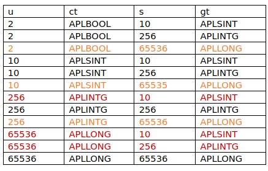

# Non Scalar Selection functions

## [Unique](../../../tests/unique.apln) (`R←∪Y`)([docs](https://help.dyalog.com/latest/Content/Language/Primitive%20Functions/Unique.htm))
Same as unqiue mask below

## [Unique Mask](../../../tests/uniquemask.apln) (`R←≠Y`)([docs](https://help.dyalog.com/latest/Content/Language/Primitive%20Functions/Unique%20Mask.htm))

Most of it is very similar to other tests so only documenting the different parts here. One thing that bugged me for a very long time was a switch case at `allos/src/same.c.html#L1311` in function `tolerant_nubsieve(void)` where the lines of code were not hit with a the normal cases.

Exerpt from ROS's email:

```
This wasn’t easy to figure out ☹

I think the important factors here are the leading shape (“s”) of the array, and the number of unique elements (“u”). This creates such a thing:

s 2⍴?u⍴0

(It assumes two identical random floats won’t be created, which is nearly but not quite safe to do.)

Now, the cluster index seems to be a vector with a length s and range of values dependent on u.

The grade-up index of the cluster index will also have a length s, but s unique values.

ct is the element type of the cluster index, so its (squeezed) type is dependent on the number of unique values. It appears it can be Boolean or 1, 2 or 4 bytes (unsigned), encoded 1, 2, 3 or 4 (referred in big switch statement as APLBOOL, APLSINT, APLINTG and APLLONG, but that’s misleading because those are signed).

gt is the element type of the grade-up index, so its squeezed type is dependent on the leading shape. It can be 1, 2 or 4 bytes (unsigned), encoded 2, 3 or 4 (APLSINT, APLINTG, APLLONG)

This gives the possible combinations (ignore the colouring for now):
```

``` 
However, there can’t be more unique elements than elements, so I think the red lines are impossible.

Also, it appears that the generated cluster index doesn’t necessarily consist of the smallest element type – in particular, if gt is APLLONG then ct is always APLLONG too. That makes the orange lines impossible.

You can get the remaining ones (those in black) by evaluating ≠s 2⍴?u⍴0, for the values u and s in the table.

(You can also test the orange cases by squeezing the value you get back from cluster_index(), but that’s not something you can do in a “standard” interpreter.)

Regards,
Richard
```